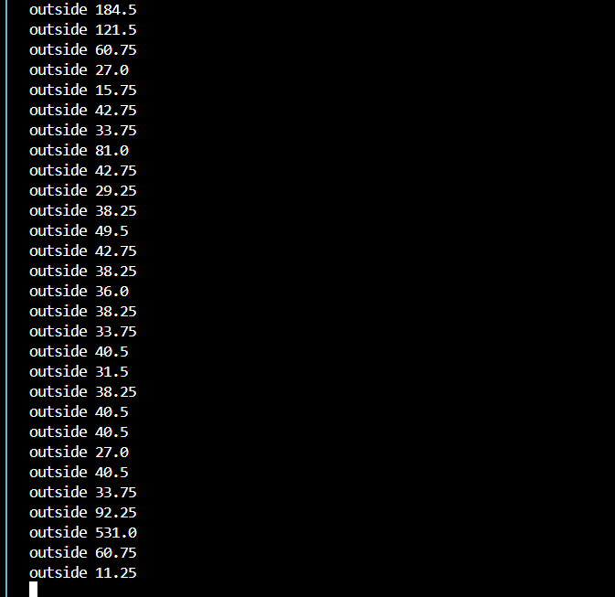
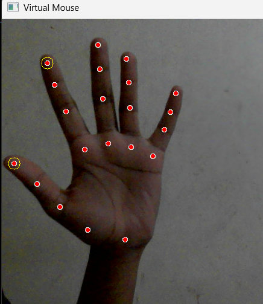
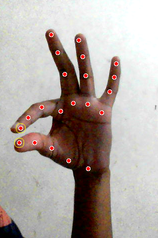

<div align="center">

# 🖱️ AI Virtual Mouse Using Hand Gesture Recognition

**A computer vision-based system that lets you control your computer cursor using nothing but hand gestures captured through a webcam.**


[](https://github.com/Khyathi-Priya/AI-VIRTUAL-MOUSE/stargazers)
[](https://github.com/Khyathi-Priya/AI-VIRTUAL-MOUSE/network)
[](LICENSE)

</div>

---

## 📌 Overview

Touchless interaction is becoming increasingly important in modern computing — from accessibility needs to hygienic, contact-free interfaces. **AI Virtual Mouse** replaces the physical mouse entirely by tracking hand movements through a webcam and translating them into real-time cursor control. By combining hand landmark detection, real-time video processing, and mouse automation, the system enables natural, gesture-based interaction without touching any hardware.

This project demonstrates how computer vision can be used to build accessible, intuitive, and contactless human-computer interaction tools.

---

## ❗ Problem It Solves

- 🖱️ Traditional input devices require physical contact, which isn't always practical or accessible
- ♿ Users with limited mobility may find a physical mouse difficult to use
- 🧼 Touchless interaction reduces the need for shared physical input devices
- 🎯 Precise gesture-based control can enable new, intuitive ways to interact with a computer

---

## 💡 Solution

AI Virtual Mouse uses **MediaPipe** for hand landmark detection, **OpenCV** for real-time video processing, and **PyAutoGUI** for mouse automation to:

1. Capture live video from the webcam
2. Detect and track 21 hand landmarks in real time
3. Map the index finger's position to screen coordinates
4. Move the system cursor accordingly
5. Recognize a thumb-index pinch gesture
6. Trigger a mouse click when the pinch is detected

---

## 📸 Screenshots







---

## 🧠 System Architecture

```
Webcam Video Feed
        ↓
Hand Landmark Detection
  (MediaPipe Hands)
        ↓
Index Finger Position Tracking
        ↓
Coordinate Mapping
  (Finger Position → Screen Coordinates)
        ↓
Cursor Movement
  (PyAutoGUI)
        ↓
Pinch Gesture Detection
  (Thumb–Index Distance)
        ↓
Mouse Click Triggered
```

---

## 🚀 Key Features

| Feature | Description |
|---|---|
| 🖐 Real-Time Hand Tracking | Detects and tracks hand landmarks live via webcam |
| 🎯 Cursor Movement Control | Index finger position drives cursor movement |
| 🤏 Pinch Gesture Click | Thumb-index pinch triggers a mouse click |
| 🚫 Touchless Interaction | No physical contact with input hardware required |
| 🪶 Lightweight Implementation | Simple, dependency-light, and easy to run |
| 👁️ Landmark Visualization | Real-time visual overlay of detected hand landmarks |

---

## 🧰 Tech Stack

| Technology | Purpose |
|---|---|
| Python | Core language |
| OpenCV | Real-time video capture & processing |
| MediaPipe | Hand landmark detection |
| PyAutoGUI | Mouse cursor movement & click automation |

---

## ⚙️ Installation & Setup

### 1. Clone the Repository
```bash
git clone https://github.com/Khyathi-Priya/AI-VIRTUAL-MOUSE.git
cd AI-VIRTUAL-MOUSE
```

### 2. Install Dependencies
```bash
pip install -r requirements.txt
```

### 3. Run the Application
```bash
python virtualMouse.py
```

---

## 📁 Project Structure

```
AI-VIRTUAL-MOUSE/
│
├── virtualMouse.py           # Main application script
├── requirements.txt          # Python dependencies
├── pictures/                   # Screenshots
└── README.md
```

---

## 📦 Requirements

```txt
opencv-python
mediapipe
pyautogui
```

---

## 🎯 Applications

- 🖱️ Touchless computer control
- ♿ Accessibility assistance for users with limited mobility
- 💻 Smart workspace interaction
- 🔬 Gesture-based human-computer interaction research

---

## 🚀 Future Enhancements

- [ ] Drag and drop functionality
- [ ] Right-click gesture support
- [ ] Scroll gesture implementation
- [ ] Multi-monitor support
- [ ] Gesture customization options

---

## 📝 Conclusion

AI Virtual Mouse shows how everyday webcams and computer vision can replace traditional input hardware with natural, gesture-based control. By tracking hand movement and recognizing simple pinch gestures, the system turns a regular camera into a fully functional, touchless mouse — making computing more accessible and opening the door to richer gesture-driven interfaces.

---

## 👩‍💻 Author

**Khyathi Priya Kamireddi**
B.Tech — Computer Science Engineering (AI & ML)

[](https://github.com/Khyathi-Priya)
[](https://www.linkedin.com/in/khyathi-priya-kamireddi-83144a2b8/)

---

## 📜 License

⭐ If you found this project useful, consider giving it a star!
